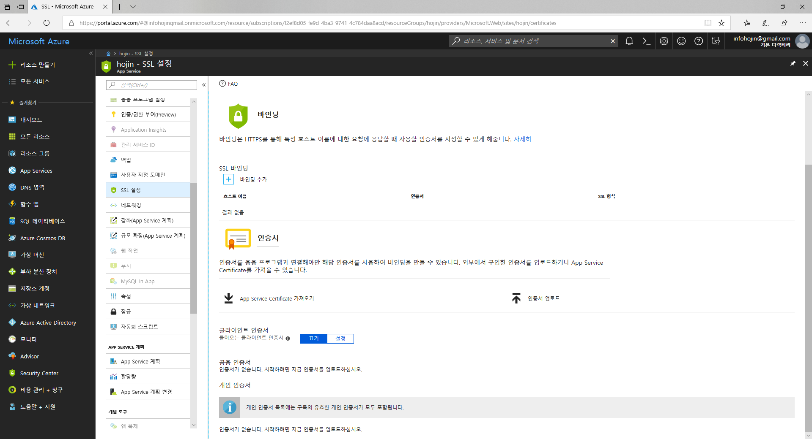
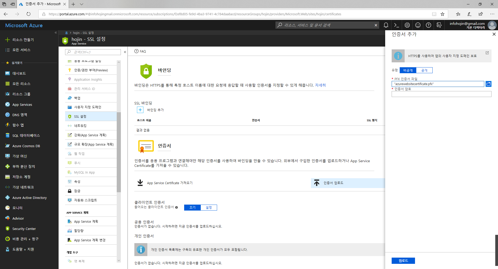
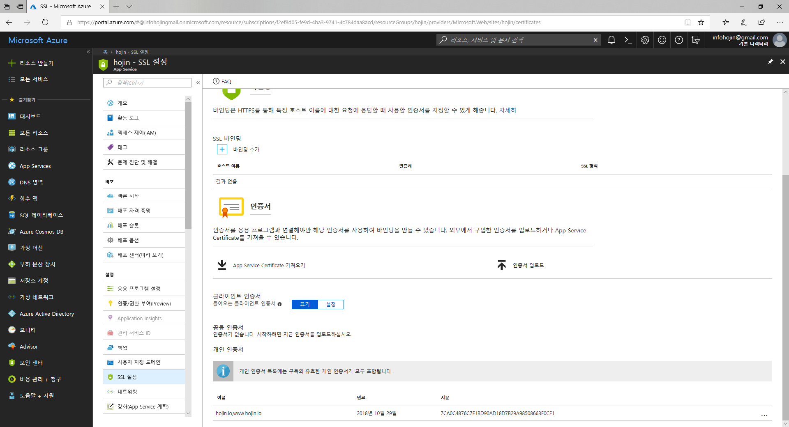
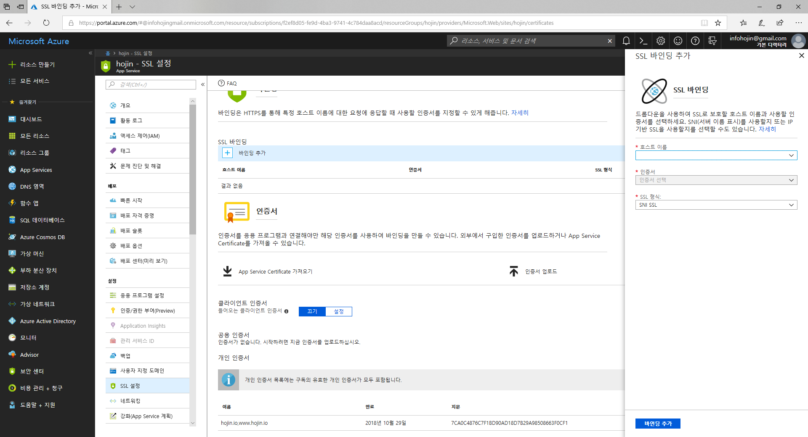
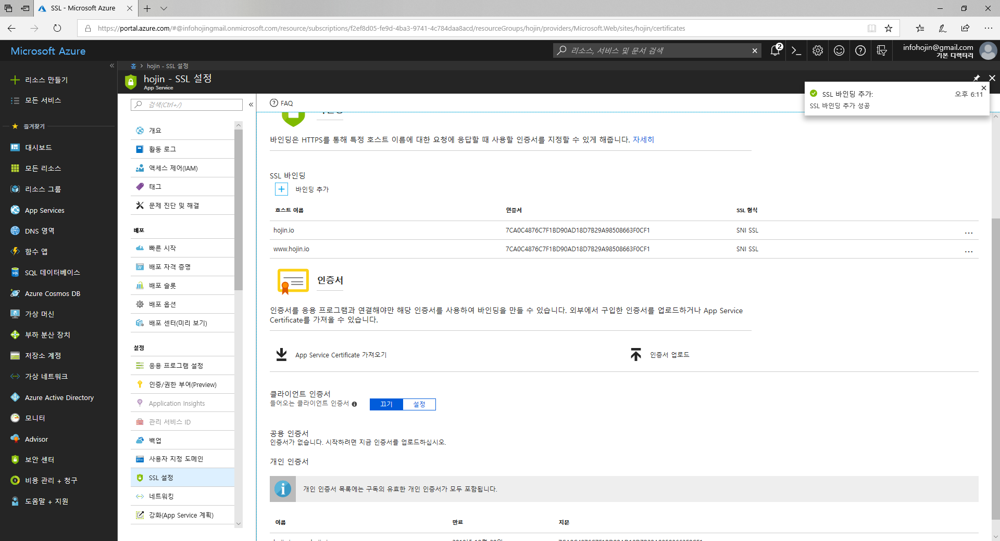

# 애저 등록
변환된 pfx 파일을 애저에 등록하여 도메인 바인등을 처리합니다. 애저 포털로 이동후에 웹앱을 선택하여 주세요.

좌측에서 인증서를 선택합니다. 이제 생성한 인증서 파일을 애저 webapp에 등록을 해보도록 하겠습니다. 

아직 개인 인증서 등록이 되어 있지 안습니다.
화면 하단에 보면 개인 인증서가 없는 것을 확인 할 수 있습니다. 

`인증서 업로드`를 선택합니다.

우측에 인증서 추가 화면이 생성된 것을 확인 할 수 있습니다. 이곳에 생성해 놓은 `azurewebsitecertificate.pfx` 인증서 파일을 찾아 등록을 합니다. 
이때 openssl로 생성시 등록한 비밀번호를 같이 입력을 하도록 합니다. 업로드를 하게 되면 개인 인증서 Azure에 등록이 됩니다.

개인 인증서 정보가 표기가 되지 않는 다면 화면을 다시 갱신해 주시면 됩니다.
하단에 새롭게 추가한 인증서 목록이 출력되는 것을 보실 수 있습니다.

 

## 도메인 바인딩
등록한 도메인과 인증서를 통하여 바인딩을 설정합니다. 바인딩을 하게 되면 해당 도메인으로 https 접속이 가능해 집니다.

도메인을 선택하고, 인증서를 선택합니다. 선택후에 `바인딩추가`를 해주시면 됩니다. 등록한 모든 도메인을 각각이 다 설정해 주시면 됩니다.

정상적으로 바인딩이 완료과 되었다면, `HTTPS`로 사이트 접속이 가능한 것을 확인 할 수 있습니다.

애저에 성공적으로 자신의 도메인을 등록하였다면, 이제는 보다 안전을 위하여 HTTPS 를 설정하는 것이 좋습니다.