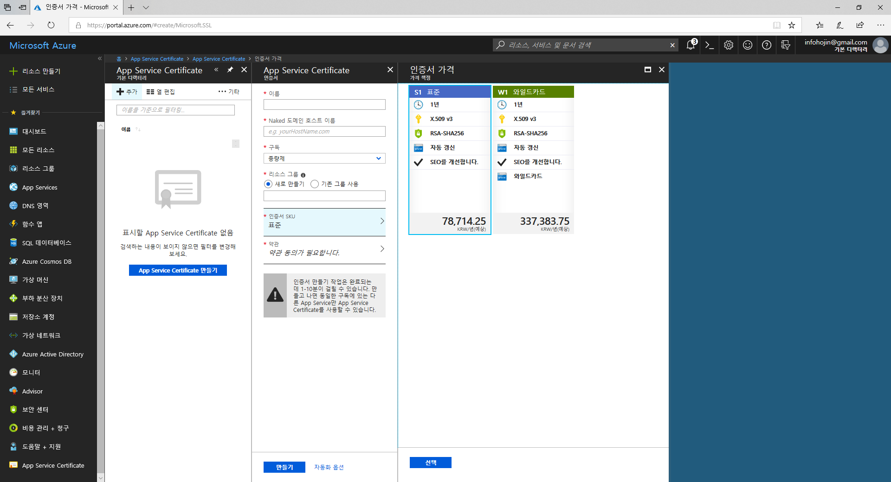
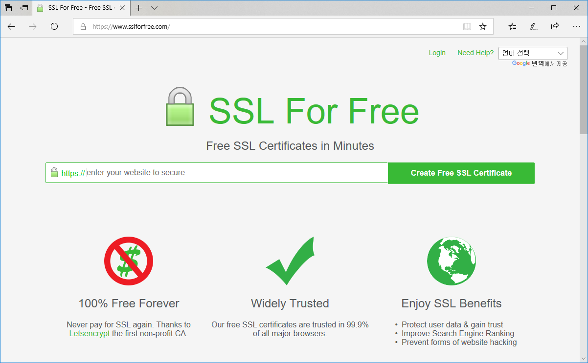
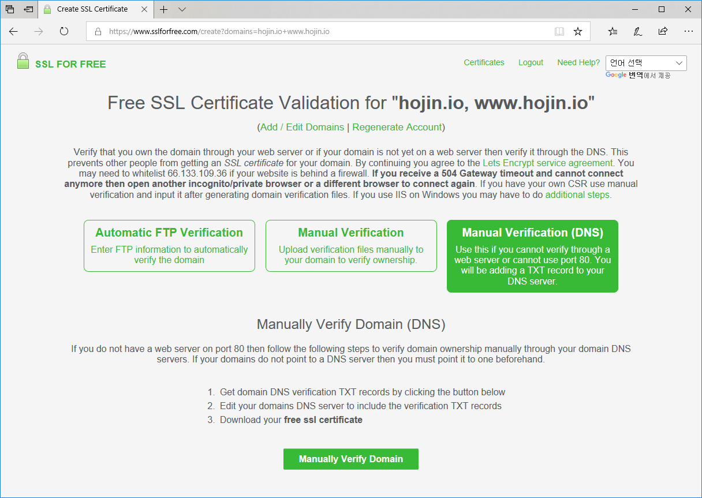
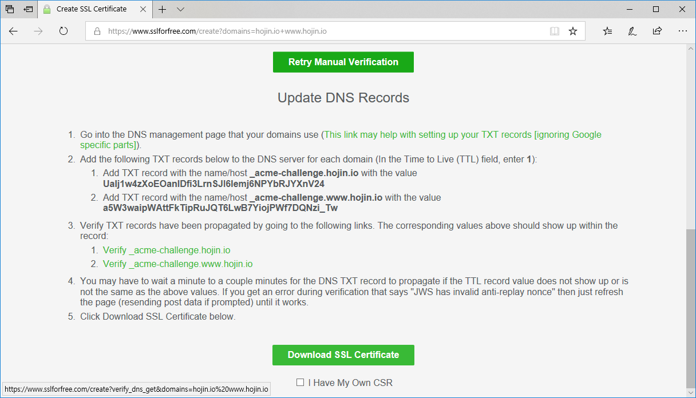
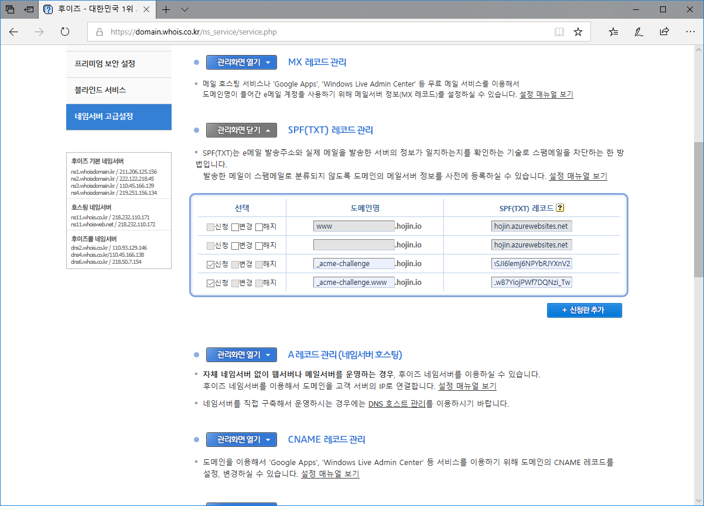
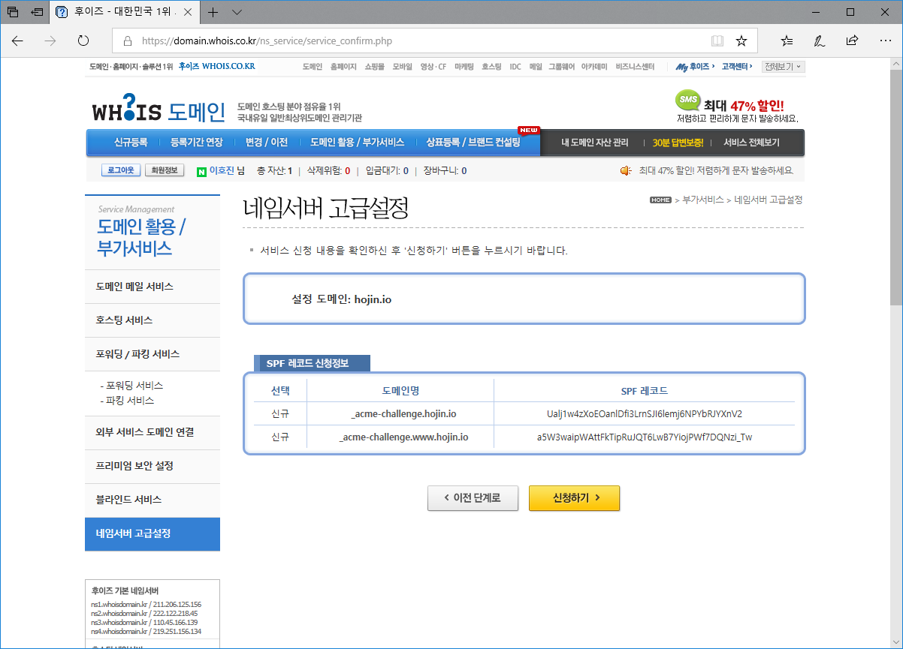
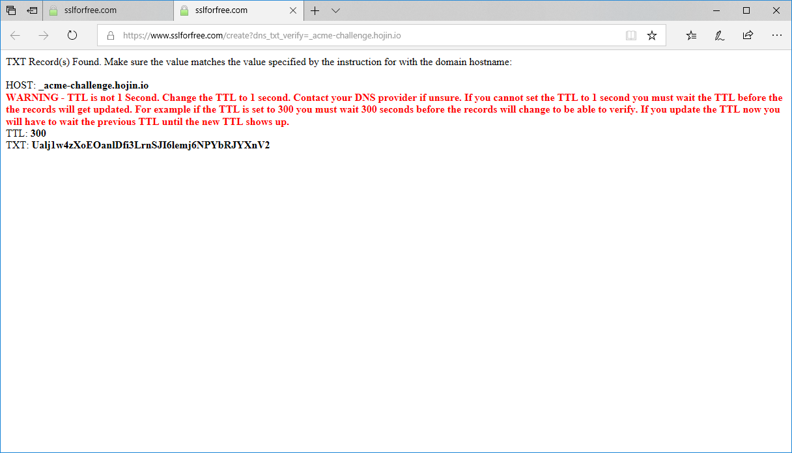
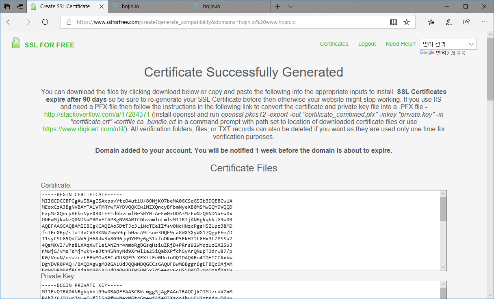
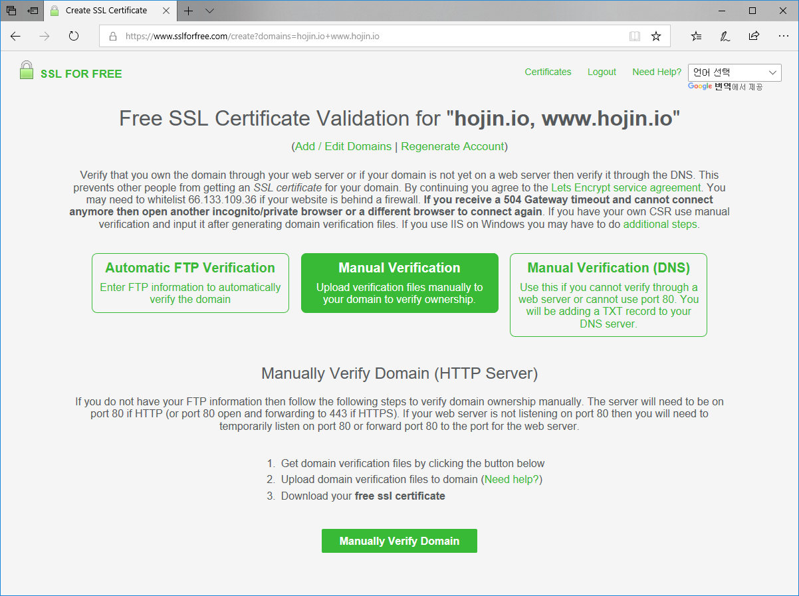
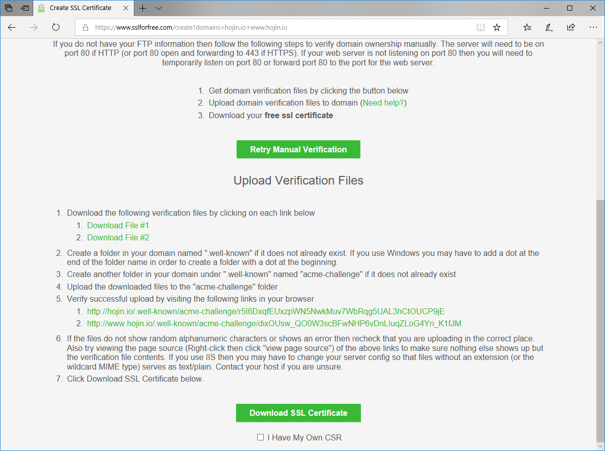

# 인증서
SSL은 외부의 인증기관(CA: Certificate Authority)을 통하여 발행된 키를 사용을 합니다. 이 인증기관은 클라이언트, 서버 모드 서로 신뢰하는 제 3의 기관입니다.
즉, 공개키는 인증기관에서 디지털 서명을 통하여 서명된 공개키를 생성하게 됩니다.

인증키는 제3의 기관을 통하여 발생되기 때문에, 금전적 비용이 소요됩니다. 국내외 다양한 업체에서 인증키에 대한 서비스를 제공합니다. 마이크로소프트 Azure 또한 제휴된 인증기간의 SSL을 구매할 수 있도록 제공을 하고 있습니다.

하지만, 비용이 적지 않은 금액이라 많은 서비스 운영자들이 부담을 느낄 수 있습니다.

 

## 무료 SSL 인증서
돈이 충분하다면, 원하는 많큼의 인증서를 구매하여 사용을 하는 것이 매우 편리합니다. 하지만, 스타트업 또느 개인이 SSL인증서를 구매하여 사용을 하기에는 비용이 적지 않습니다.
다소 불편하지만 인증서를 무료로 얻을 수 있는 방법이 있습니다. 다만, 유료버전 1년에 비해서 유효기간이 3개월 짧은 것이 단점입니다. 매번 재갱신을 해주어야 합니다. 그외 보증보험등에 대한 차이가 있습니다.

이는 

https://www.sslforfree.com 에 접속을 합니다. sslforfree은 많은 사이트들이 SSL을 적용하여 보안 문제 해결을 할 수 있도록 도와주기 위한 공개소프트 프로젝트들의 노력 입니다. 
접속시 크롬브라우저를 사용 권장합니다.

회원 가입이 되어 있지 않은 경우에는, 먼저 회원 가입을 합니다. 회원가입을 하게 되면 인증서 만료가 되었을 경우에 안내 메일을 받을 수 있습니다.

첫페이지에서 인증받고자 하는 도메인을 입력합니다. 
도메인을 입력시 `호스트명`을 제외하면 자동적으로 도메인과 `www`호스트명이 들어간 두개의 설정에 대해서 인증서를 생성하여 줍니다.

SSLforfree는 도메인에 대하여 SSL을 인증을 받을 수 있는 3가지 방식을 제공합니다. FTP, HTTP, Nameserver

 

## 네임서버 인증
도메인 등록기관의 네임서버 설정을 통하여 사이트의 인증을 받는 방법입니다. SSLforfree에서 제공하는 TXT 레코드를 네임서버에 등록하여 인증을 받는 방법입니다.

하단의 `Manually Verify Domain`을 클릭하면 다음과 같이 인증을 위한 TXT 정보가 출력이 됩니다.

 

## TXT 등록
위의 정보를 자신의 도메인 관리 업체에 등록을 합니다. 

도메인 등록 관리 업체마다 적용 방법은 차이점이 있습니다. `후이즈`의 경우 네임서버 고급설정으로 들어가서 TXT를 추가할 수 있습니다.

신청란 추가를 통하여 설정을 합니다.

설정이 완료가 된 후에, SSLforfree 사이트 밑에 있는 확인 URL을 클릭합니다. 

인증받을 도메인이 여러개인 경우, url이 여러개를 모두 클릭 하셔야 합니다.

TTL을 1로 설정을 하라고 `경고` 가 나오는데, 이는 도메인 업체에서 해결을 요청하여야 합니다.

정상적으로 인증이 되면, 다음과 같이 인증서 파일을 다운로드 받을 수 있는 화면이 출력 됩니다.

인증서를 다운로드 받아 저장을 하세요.

 

## HTTP
네임서버 인증방법 이외애 HTTP를 통한 인증을 받는 방법도 있습니다. 네임서버를 통하여 받는 방식보다 좀더 수월합니다.
이 방식은 국내 도메인 호스팅의 회사들이 다양한 네임서버 설정 지원을 하고 있지 않기 때문에, 좀더 유용한 방법일 수 있습니다.

`Manual verification`을 선택합니다.

하단의 `Manually Verify Domain`을 클릭하면 서버에 올려 놓을 파일을 다운로드 받을 수 있습니다.

서버에 `.well-known` 폴더를 만들고 안에 다시 `acme-challenge`를 만듭니다. 폴더 안에 다운로드 받은 넣어 둡니다.
그리고 확인 URL을 클릭하여 인증을 처리합니다.

정상적으로 인증이 완료 되었다면 `Download SSL Certification`을 선택합니다.

정상적으로 인증이 되면, 다음과 같이 인증서 파일을 다운로드 받을 수 있는 화면이 출력 됩니다.

인증서를 다운로드 받아 저장을 하세요.
