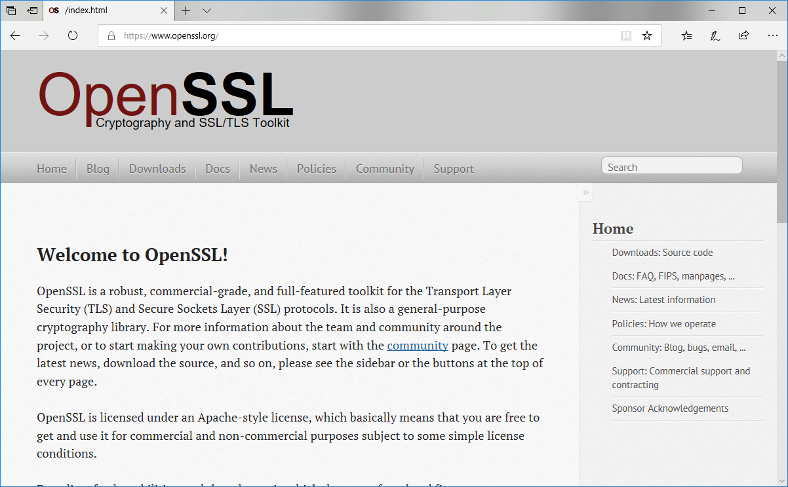

# Azure 인증서 만들기
다운로드 받은 SSL 인증서를 통하여 Azure에서 사용하기 위해서는 pfx 형태로 변경을 해야 합니다. openssl을 통하여 이를 쉽게 변경작업 할 수 있습니다.



<br>

## openSSL 다운로드
openSSL 파일은 http://code.google.com/p/openssl-for-windows/downloads/list 에서 다운로드 받을 수 있습니다.
자신에 윈도우에 맞는 최신버전 zip 파일 다운로드 합니다. 다운로드 받은 압축 파일을 풀어 줍니다.


편하게 작업하기 위해서 다운로드 받은 SSL 인증서를 이곳에 복사를 합니다. `openssl.exe` 파일을 클릭하여 실행합니다. 

<br>

## pfx
애저용 PFX 인증 파일을 생성합니다. openssl을 실행후에 다음과 같이 코드를 복사하여 실행합니다.

```php
pkcs12 -inkey private.key -in certificate.crt -certfile ca_bundle.crt -export -out azurewebsitecertificate.pfx
```


명령을 입력하면, 인증서에 대한 비밀번호를 입력요구를 합니다. 두번 입력을 합니다. 정상적으로 인증서 생성이 성공되었으면 창을 닫아 주시면 됩니다.


정상적으로 애저에서 등록 사용할 수 있는 `azurewebsitecertificate.pfx` 인증서 파일이 생성 된 것을 확인 할 수 있습니다.

<br>