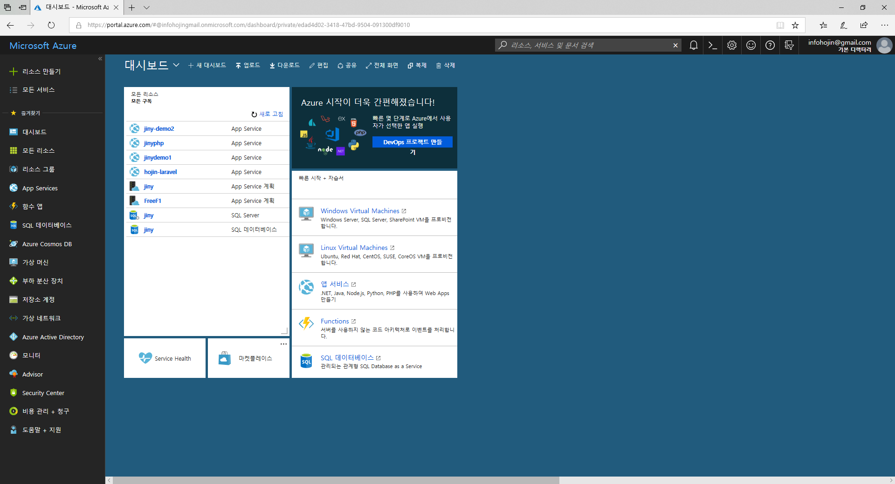
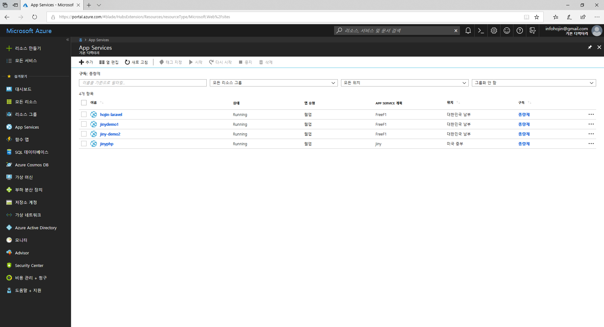
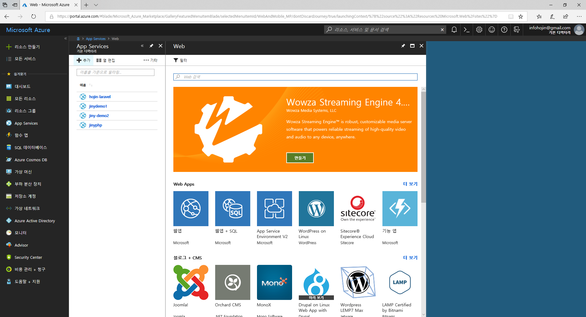
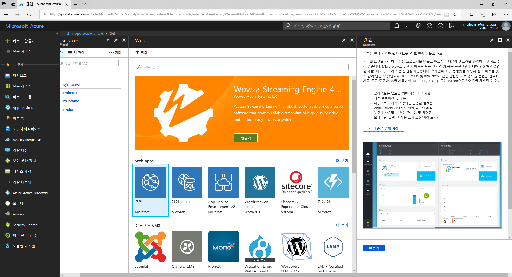
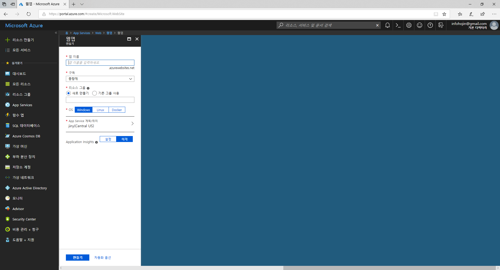
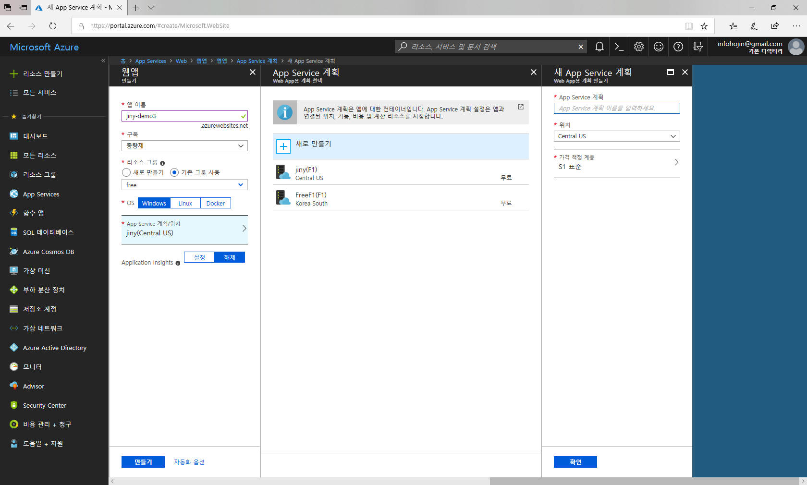
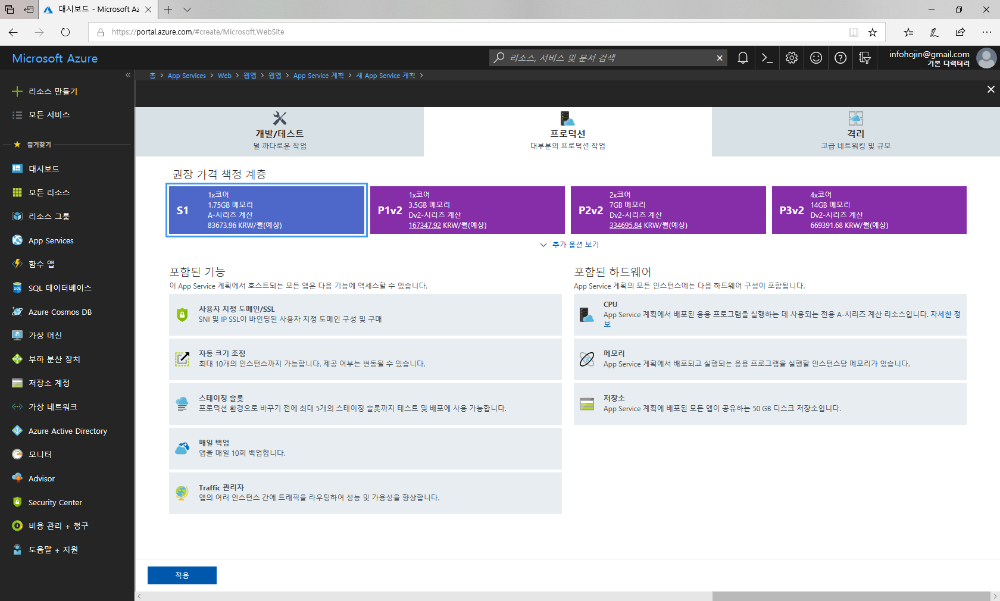
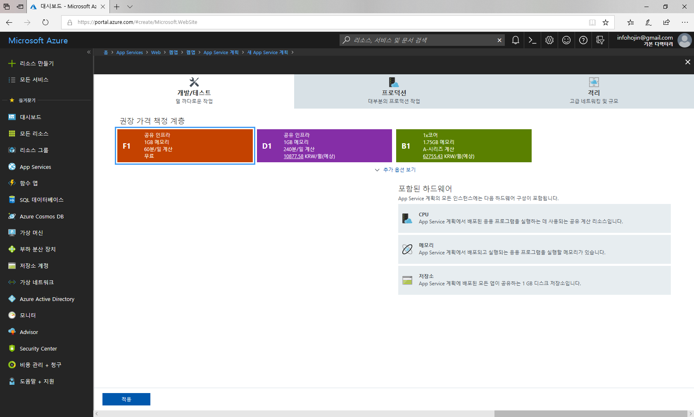
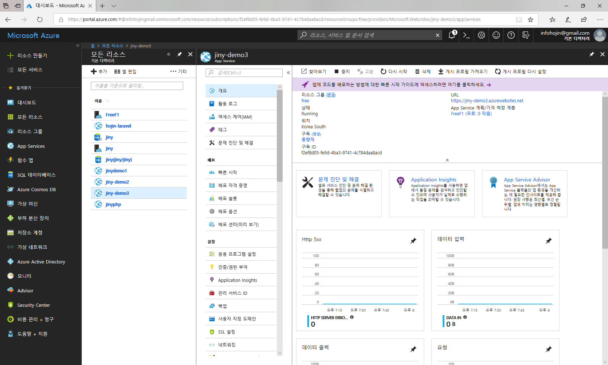
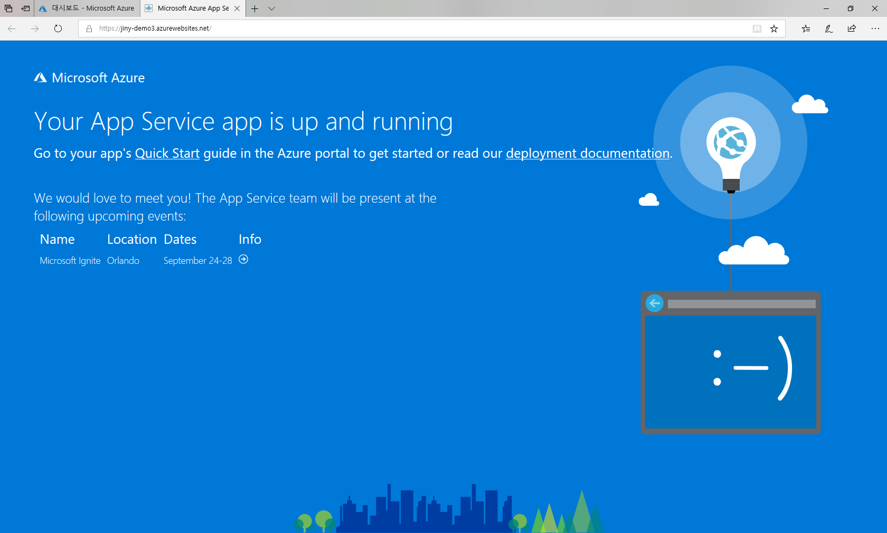

# WebApp
`WebApp`은 Azure에서 인기있는 `Paas` 서비스중 하나 입니다. `Paas`는 하드웨어와 운영체제를 직접 관리할 필요없습니다. Azure는 여러 인기있는 서비스 구축 환경을 미리 만들어 놓은 페키지 입니다.

PHP 응용프로그램과 지니PHP를 마이크로소프트 Azure Paas에 배포하여 서버를 구축할 수 있습니다.

 

## 서비스 생성하기
Azure에서 `WebApp`을 생성하기 위해서는 먼저 애저포털에 접속을 해야 합니다.
자신의 계정으로 https://portal.azure.com 으로 접속을 합니다.

좌측 메뉴에서 `App 서비스`를 선택합니다. 서비스 되는 App 의 목록들과 서버위치 정보들이 출력됩니다.

상단의 `+`를 선택하여 새로운 webApp을 생성할 수 있습니다.

Azure는 다양한 `Paas` 서비스를 제공합니다. 대부분의 수많은 서비스들이 `Paas`형태로 패키지화 되어 있습니다.
이중에서 가장 기본인 `웹앱`을 선택합니다.

웹앱에 대한 설명을 간단하게 옆의 창에 기술되어 있습니다. `만들기` 버튼을 클릭합니다.

기본적인 몇개의 정보를 입력해야 합니다. 먼저 웹의 이름을 입력합니다. 생성되는 앱의 이름은  `.azurewebsite.net` 도메인의 호스트명 입니다.
앱의 이름을 입력하게 되면 `앱명.azurewebsite.net` 도메인 주소로 접속을 할 수 있습니다.

이 도메인은 애저에서 기본적으로 사용자에게 제공하는 도메인 주소입니다. 애저 사용자들의 앱들 구별하여, 여러 사용자들이 같이 사용을 하는 도메인 주소인 것입니다.
따라서 여러 사람들과 이름이 겹치지 않도록 앱명을 입력을 해야 합니다. 

두번째는 구독을 선택합니다.
애저는 기본적으로 처음 회원 가입시 무료로 사용할 수 있는 일정비용을 제공해 줍니다. 이 비용과 기간이 만료가 되면 서비스가 중단됩니다. 또한 별도의 추가 비용을 요구하지 않습니다.
생성한 서비스를 계속 유지하기 위해서는 별도의 유료 계정을 등록하여 연결을 해야 합니다.

세번째로 리소스그룹을 생성합니다. 
리소스 그룹은 여러개의 앱등을 관리할 수있는 그룹이라 생각하시면 됩니다.

다음은 서버의 타입입니다.
애저는 여러 종류의 서버타입을 제공합니다. PHP로 가장 많이 사용하는 리눅스, 전형적인 윈도우기반, 가상화 이미지인 도커를 지원합니다.

다음으로는 서버의 타입과 위치 입니다.
서버타입에 따라서 가격은 많이 차이가 나게 됩니다. 또한, 국내 외의 서버도 선택할 수 있습니다. 애저는 전세계에 분포되어 있는 서버를 선택하여 생성할 수도 있습니다.

`계획/위치`를 선택하시면 우측에 새로운 창이 생성이 됩니다. `새로만들기`를 선택하여 서버의 종류를 선택할 수 있습니다.

기본 서버종류는 `S1` 입니다. 서버를 선택하시면 더 다양한 서버를 선택할 수 있습니다.

만일 개발용 테스트로 사용을 하고자 한다면, 상단 텝에서 `개발/테스트`를 선택합니다. 애저는 개발자들에게 무료로 테스트 할 수 있는 작은 용량의 서비스도 제공합니다.

서버를 선택하고 `적용`을 클릭합니다. 다음에 `만들기` 선택하게 되면 새로운 `웹앱`을 생성하게 됩니다.

`웹앱`이 생성되면 위와 같이 들어가서 서버를 설정할 수 있습니다. 또한 앞에서 설정한 웹앱 이름을 통하여 임시 페이지에 접속을 할 수 있습니다.

