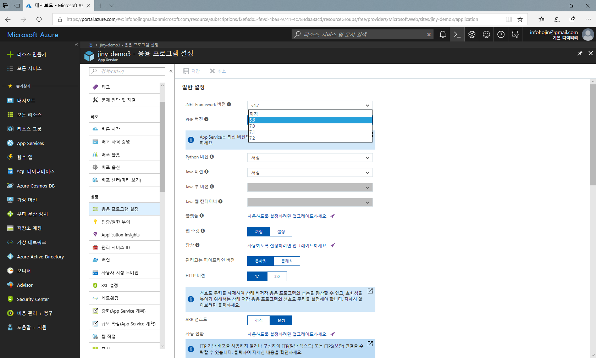

## 응용 프로그램 설정

Azure webapp을 생성후에 간단한 PHP의 버전을 설정할 수 있습니다.
좌측 메뉴에서 `응용 프로그램 설정`이라는 메뉴를 선택합니다.

webapp은 다양한 버전의 PHP, 그외 언어들이 같이 설치가 됩니다.
기본적으로 PHP 5.7, 7.0, 7.1, 7.2 등 최신의 PHP 버전을 다양하게 지원 합니다. PHP 프레임워크들은 보완을 위해서 최신의 PHP 버전을 요구하는 경우가 많이 있습니다.
이런 경우 서버에서 별도의 작업 없이도 최신의 PHP버전을 제공해 주는 것은 매우 유용합니다.

설정 후에는 `저장` 버튼을 눌러 서버 적용을 합니다.

